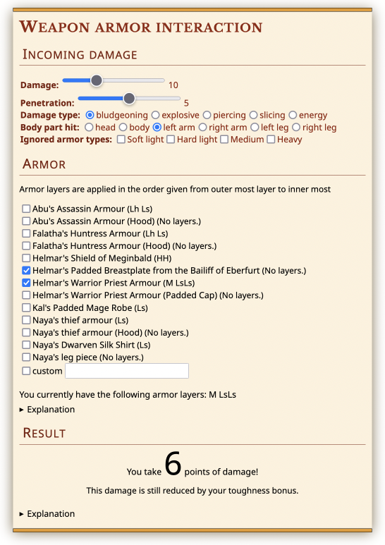

# Pen & Paper Armor Interaction Calculator 🏹🛡️

[](https://results.pre-commit.ci/latest/github/klieret/RandomFileTree/master)
[](https://gitmoji.dev)
[](https://github.com/python/black)
[](https://github.com/klieret/pp-armor-interaction/blob/main/LICENSE.txt)

This is a small calculator for calculating damage in a
[pen & paper RPG](https://en.wikipedia.org/wiki/Tabletop_role-playing_game).
It is also a small experiment to try out client-side web programming with [brython](https://brython.info/).

[👉 **Go to the online calculator** 👈](https://klieret.github.io/pp-armor-interaction/index.html)

[](https://klieret.github.io/pp-armor-interaction/index.html)

## How to run it locally

Clone the repository and start a small HTTP server

```bash
python3 -m http.server
```

and open the link that is displayed.

## The algorithm

Given a table that calculates penetration modifiers based on damage type,
armor type and armor points, the resulting damage is calculated as

```
algorithm calculate-damage is
    input: damage type (string),
           damage (int >= 0),
           penetration (int >= 0),
           armor
    output: damage taken

    remaining penetration ← penetration
    remaining damage ← damage
    for each armor layer (string armor type, int armor points) in armor do
        penetration modifier ← looked up in a table based on (damage type, armor type, armor points)
        remaining penetration ← max(0, remaining penetration - penetration modifier)
        remaining armor points ← max(0, armor points - remaining penetration)
        remaining penetration ← max(0, remaining penetration - armor points)
        remaining damage ← max(0, remaining damage - 2*remaining armor points)
    return remaining damage
```

## License

[](https://github.com/klieret/pp-armor-interaction/blob/main/LICENSE.txt)

The styling of the calculator is using [CSS](https://codepen.io/retractedhack/pen/gPLpWe) from [Chad Chartered](https://codepen.io/retractedhack).
